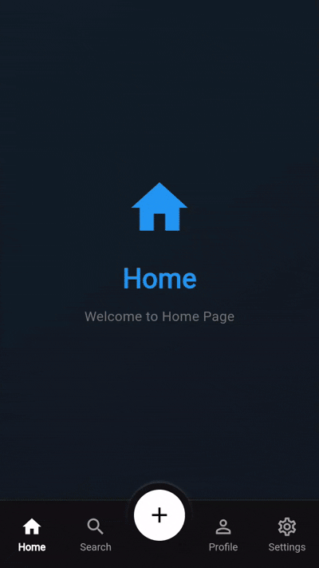

[English](README.md) | 简体中文

# 圆形悬浮按钮底部导航栏

一款精美的 Flutter 插件，提供可自定义的底部导航栏，带有圆形悬浮操作按钮。按下 FAB 时，会显示带有模糊背景效果的动画选项。

## 功能特点

- ✨ 圆形悬浮按钮，凸出在导航栏上方
- 🎭 按下 FAB 时选项会滑动显示
- 🌫️ 覆盖整个屏幕的模糊背景效果
- 🎨 完全可自定义的颜色、尺寸和动画效果
- 📱 响应式设计，适配所有屏幕尺寸
- 🚀 流畅的动画效果，可自定义持续时间和曲线

## 动画示例



## 使用方法

### 基础用法

```dart
import 'package:circular_fab_bottom_nav/circular_fab_bottom_nav.dart';

Scaffold(
  bottomNavigationBar: CircularFabBottomNav(
    currentIndex: _currentIndex,
    onTap: (index) {
      setState(() {
        _currentIndex = index;
      });
    },
    items: [
      CircularBottomNavItem(
        icon: Icon(Icons.home_outlined),
        activeIcon: Icon(Icons.home),
        label: '首页',
      ),
      CircularBottomNavItem(
        icon: Icon(Icons.search_outlined),
        activeIcon: Icon(Icons.search),
        label: '搜索',
      ),
    ],
    fabOptions: [
      FabOptionItem(
        icon: Icons.camera,
        iconColor: Colors.white,
        backgroundColor: Colors.blue,
        title: '相机',
        subtitle: '拍摄照片',
        onTap: () {
          // 处理相机选项
        },
      ),
    ],
  ),
)
```

### 高级用法

```dart
CircularFabBottomNav(
  currentIndex: _currentIndex,
  onTap: (index) => setState(() => _currentIndex = index),
  items: navItems,
  fabOptions: fabOptions,
  // 自定义设置
  backgroundColor: Color(0xFF111113),
  fabBackgroundColor: Colors.white,
  fabIconColor: Colors.black,
  fabSize: 76.0,
  fabElevation: 20.0,
  selectedItemColor: Colors.white,
  unselectedItemColor: Colors.grey,
  iconSize: 26.0,
  height: 80.0,
)
```

## 配置说明

### CircularFabBottomNav 属性

| 属性                    | 类型                            | 默认值                 | 描述           |
|-----------------------|-------------------------------|---------------------|--------------|
| `items`               | `List<CircularBottomNavItem>` | 必填                  | 导航栏项目        |
| `currentIndex`        | `int`                         | 必填                  | 当前选中的标签页索引   |
| `onTap`               | `ValueChanged<int>`           | 必填                  | 导航项点击回调      |
| `fabOptions`          | `List<FabOptionItem>`         | 必填                  | FAB 按下时显示的选项 |
| `backgroundColor`     | `Color`                       | `Color(0xFF111113)` | 导航栏背景色       |
| `fabBackgroundColor`  | `Color`                       | `Colors.white`      | FAB 背景色      |
| `fabIconColor`        | `Color`                       | `Colors.black`      | FAB 图标颜色     |
| `fabSize`             | `double`                      | `76.0`              | FAB 直径       |
| `fabElevation`        | `double`                      | `20.0`              | FAB 凸出导航栏的高度 |
| `selectedItemColor`   | `Color`                       | `Colors.white`      | 选中导航项的颜色     |
| `unselectedItemColor` | `Color`                       | `Colors.grey`       | 未选中导航项的颜色    |
| `iconSize`            | `double`                      | `26.0`              | 导航项图标尺寸      |
| `height`              | `double`                      | `80.0`              | 导航栏高度        |

### CircularBottomNavItem 属性

| 属性           | 类型        | 默认值  | 描述      |
|--------------|-----------|------|---------|
| `icon`       | `Widget`  | 必填   | 未选中时的图标 |
| `activeIcon` | `Widget`  | 必填   | 选中时的图标  |
| `label`      | `String?` | null | 可选的文本标签 |

### FabOptionItem 属性

| 属性                | 类型             | 默认值 | 描述     |
|-------------------|----------------|-----|--------|
| `icon`            | `IconData`     | 必填  | 选项图标   |
| `iconColor`       | `Color`        | 必填  | 图标颜色   |
| `backgroundColor` | `Color`        | 必填  | 选项背景色  |
| `title`           | `String`       | 必填  | 选项标题   |
| `subtitle`        | `String`       | 必填  | 选项副标题  |
| `onTap`           | `VoidCallback` | 必填  | 选项点击回调 |

## 动画细节

- **FAB 旋转**: FAB 图标在打开/关闭选项时旋转 45°
- **选项滑动**: 选项从底部滑动显示，带有错开的延迟效果
- **模糊效果**: 背景模糊覆盖整个屏幕，包括导航栏
- **平滑曲线**: 使用 `Curves.easeOutBack` 实现悦目的动画效果

## 使用提示

1. **堆栈使用**: 如果需要模糊效果覆盖应用栏或其他 UI 元素，请确保将 Scaffold 包装在 Stack 中

2. **安全区域**: 导航栏会自动适配安全区域，但请确保主要内容也做了适配

3. **性能考虑**: 模糊效果已优化，但在低端设备上仍需考虑性能影响

## 示例

查看 `example` 文件夹，了解展示插件所有功能的完整实现示例。

## 贡献

欢迎贡献代码！请随时提交 Pull Request。

## 许可证

本项目采用 MIT 许可证 - 详见 [LICENSE](LICENSE) 文件。